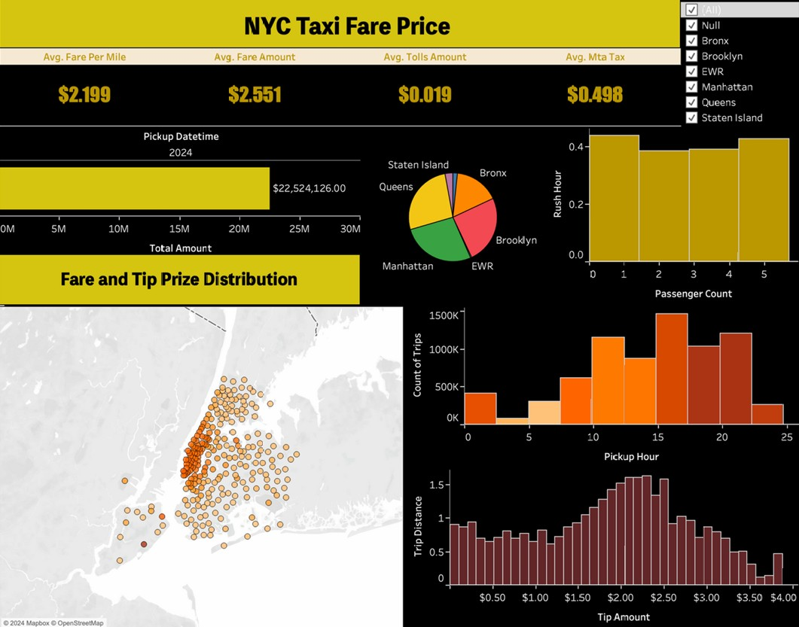

# Markets From Patterns to Predictions: Data Mining and Modeling of NYC Taxi Trips

## Overview
This project leverages a combination of predictive modeling, classification techniques, clustering, and pattern mining to analyze NYC taxi trip data from the Taxi and Limousine Commission (TLC). The goal is to uncover key insights about urban mobility—such as fare estimation, trip duration forecasting, and payment behaviors—to support strategic decisions for optimizing taxi operations and urban planning.

## Features
- **Predictive Modeling:** Forecasts fare amounts, trip durations, and tipping probabilities using techniques like ARIMA and MLP.
- **Classification & Clustering:** Segments taxi trips into demand levels (low, medium, high) and clusters trips to reveal distinct travel behaviors across zones.
- **Pattern Mining:** Uses association rule mining (e.g., Apriori) to identify frequent itemsets and relationships between taxi zones and payment methods.
- **Interactive Dashboard:** An interactive Tableau dashboard visualizes demand trends, route patterns, and key performance metrics for actionable insights.

## Dashboard Screenshot


## Technologies Used
**Languages & Libraries:** Python, Pandas, scikit-learn  
**Modeling Techniques:** Predictive Modelling, Time Series Modelling, Classification (Random Forest, XGBoost, Logistic Regression, SVM), Clustering (Hierarchical, K-Means, GMM), Pattern Mining (Association Rule Mining, Apriori)  
**Visualization:** Tableau  
**Data Storage:** AWS S3, Parquet

## Project Workflow
1. **Data Collection:** Collected NYC taxi trip data (first three months of 2024) in Parquet format for efficient storage and retrieval.
2. **Data Preprocessing:** Cleaned data by handling missing values, outliers, and duplicates; performed feature engineering (e.g., trip duration, average speed).
3. **Modeling:** Built predictive models to forecast key metrics and applied classification and clustering to segment demand and reveal travel patterns.
4. **Visualization:** Developed an interactive dashboard in Tableau to present insights and facilitate data-driven decision-making.
5. **Insights:** Uncovered high-demand zones, prevalent payment methods, and key route relationships to support optimized taxi dispatching and urban mobility strategies.

## Key Insights
- **Consistent Demand Patterns:** Taxi trips are evenly distributed on weekdays, with peak activity observed on Fridays and Saturdays. Peak hours from 5 PM to 8 PM highlight the critical rush-hour period.
- **Manhattan as the Hub:** Specific Manhattan zones (236, 237, 161, 107, and 132) consistently record the highest trip counts, establishing Manhattan as the epicenter of NYC taxi activity. Additionally, inter-borough connectors between Queens and Manhattan play a vital role in overall demand.
- **Payment Trends & Revenue Opportunities:** Short to medium trips (0.1–4 miles) exhibit a strong preference for digital payments—with over 90% of trips in key zones being cashless—and generate higher revenue per mile compared to longer trips.
- **Operational Efficiency & Strategic Impact:** Variations in trip duration and passenger counts between weekdays and weekends provide actionable insights for fleet management. These findings can drive strategic improvements in taxi dispatch, pricing strategies, and resource allocation.

## Installation
1. **Clone the Repository:**
   ```bash
   git clone https://github.com/saivivek55/Data-Mining-Project_NyC-Taxi.git

2. **Install Dependencies:**
   ```bash
   pip install -r requirements.txt

3. **Run the Scripts:** Execute all the main data processing script to generate insights.

## Conclusion
This project provides a data-driven approach to optimizing NYC taxi services by predicting key performance metrics, segmenting trip demand, and uncovering recurring travel patterns. The interactive dashboard offers actionable insights for improving fleet dispatch, route planning, and operational efficiency.

## License
This project is licensed under the Apache License.
